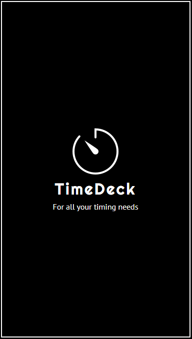
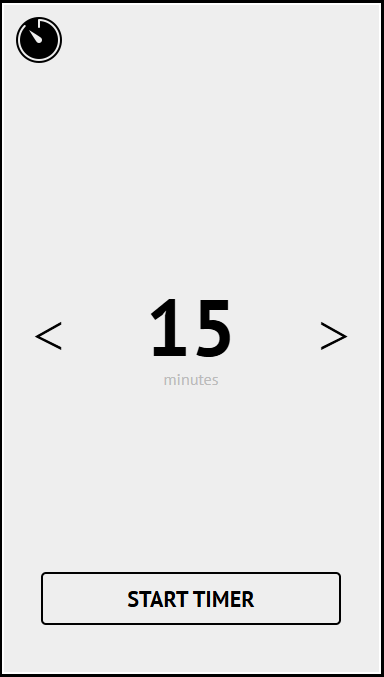
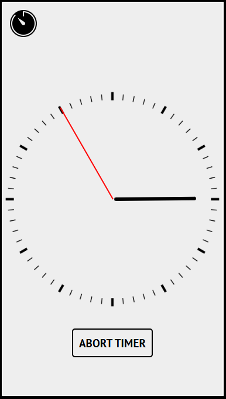
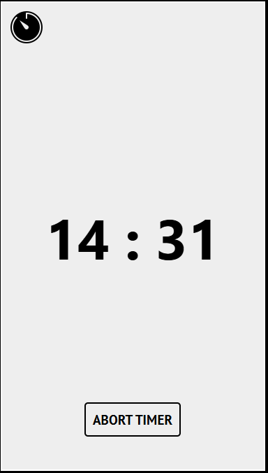
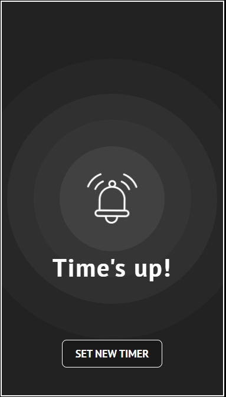

# TimeDeck timer App

## Description
The TimeDeck timer App is a mobile-friendly web application designed for time tracking, built with **React**, **Framer Motion** for animations, and **EasyTimer React Hook** for timer functionality. This app provides a versatile and user-friendly experience for setting, displaying, and managing a countdown timer with multiple views.

## Features
The app includes several views that allow the user to manage and display the timer in different ways:

1. **Loading View**: An introductory screen that displays a logo and slogan. The user proceeds to the **Set Timer** view by clicking the logo.

2. **Set Timer View**: Here, the user sets the timer in minutes using arrows to increase or decrease the value. Once the timer is set, it starts, and the user is navigated to the analogue timer view.

3. **Analogue Timer View**: Displays the timer as an analog clock with second and minute hands that animate to indicate the passage of time. The user can cancel the timer to return to the **Set Timer** view.

4. **Digital Timer View**: Shows the countdown in digital format, displaying minutes and seconds. A button to cancel the timer is available here as well.

5. **Text Timer View**: Displays the remaining time in words, e.g., "Two minutes and thirty seconds." A button to cancel the timer is also provided.

6. **Alarm View**: This view is shown when the timer reaches zero. It displays a vibrating alarm clock and a button to return to **Set Timer** and configure a new time.

## Animations and Design
- **Framer Motion** is used to create smooth animations in the sidebar menu, which appears when the user clicks the logo in the top left corner.
- **CSS Animations** are used to create pulsing circles in the background of **Alarm View** and to add a vibrating effect to the alarm clock.

## Technologies
- **React** for component management and view transitions.
- **[Framer Motion](https://www.framer.com/motion/)** for animations.
- **[EasyTimer React Hook](https://github.com/albert-gonzalez/easytimer-react-hook)** for timer logic, with support for countdown, start, and stop functions. 
- **CSS** for custom styles and additional animation effects.

## Use Cases
The Timer App is suitable for a variety of timing scenarios, such as:
- Kitchen timer for cooking.
- Focus and break timers for work or study sessions.

